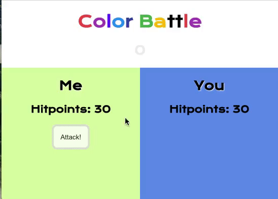

# Collaboration with GitHub

## Collaborate with a Partner to Create a Color Battle Game with React

Today you will work with a partner to create a React app, put it on GitHub, and collaborate with a partner to build a simple game of chance.

Each partner will take turns driving and being the passenger.

The game will be simple, and the functionality should end up similar to this:



- Each player will start with the same amount of hit points.
- Each player will have a button that will allow an attack on the other player.
- Each player can only attack once; players must take turns with their attacks.
- The attack points will be a randomly generated number.
- The player who falls below 0 first loses.

## Special Grading Note

The goal of this lab is to work collaboratively with GitHub. A minimum of three commits for each partner and one additional branch per partner that has been merged into `main` is expected. While progress should be demonstrated with making the game (each member has contributed code), completing all the functionality is not required to pass this lab.

## Getting Started

- Choose one person to be the `owner` of this project. This person will create the repository on their GitHub, and then they will add the other person as a `collaborator`.

The owner will start as the driver.

**Owner**

- In Terminal, navigate to your Desktop or another convenient folder.
- `git status to make sure you are not already in a `git` repository.
- Create a new React app called `color-battle.
- Make this app your own by replacing the `App` code with some HTML elements that make sense for this project.
- Don't add too much yet (example below), since you will be collaborating with your partner, and moving to the next step is critical.

```html
<div>
  <header>
    <h1>Color Battle</h1>
  </header>
</div>
```

Check that your app still works in the browser. Once it is set, put it on GitHub.

## Getting Started GitHub

**Owner**

- Go to [GitHub](https://github.com) and click `New Repository` from the nav bar.


- Name the repo and select a name for your repo.


**IMPORTANT!** Do NOT add a `README.md`, `.gitingore`, license, etc., through GitHub. When you create a new repository, and you already have code (your React app) that you'd like to upload, all these will be made for you. If you create these elements on GitHub and locally, you must take extra steps to merge these `unrelated histories`.

<details><summary>SUCCESS - Go to next step</summary>


</details>

<br>

<details><summary>TRY AGAIN, delete the repository and start over (fastest way to fix)</summary>


</details>

<br>

- Go to the second section
  `…or push an existing repository from the command line.`

- Copy the terminal commands and go back to the Terminal
- Use <kbd>⌘</kbd> <kbd>t</kbd> to open a new tab in Terminal while leaving your react development server running
- `git add .`
- `git commit -m 'first commit'`.
- In the new tab, paste your code from your clipboard. This action will:
  - Add the remote location of your GitHub repo to this project,
  - It will also name your project's `main` branch.
  - Finally, it will push your project to GitHub
- Refresh your browser to check that you now see your react project files in your GitHub repo

- Got to the `Settings` tab:


- Choose `Manage Access` From the left menu.
- Find the green button that says `Invite a collaborator`.


- Ask your teammate for their GitHub username and enter it.
- Your teammate should get an email invitation to collaborate.

## Switch! The collaborator is now the driver.

- Accept your invite to collaborate and navigate to the GitHub repository.

- In Terminal, navigate to your Desktop or another convenient folder.
- git status to make sure you are not already in a git repository.
- In GitHub, use the green code button to copy the repository's URL.


**Back in terminal**

- `git clone <Copied GitHub URL>`.
- `cd color-battle` (or whatever this repo is named, you can type `ls` to check).
- `npm install`
- Start the app.
- Let the development server start, and you should see your app in the browser now.
- In the app component, add the constructor function and add state.

## Make a branch

Practice using git branches for collaboration. Since this is a simple, short training build, just name the branch you work on after yourself.

Be sure to switch driver/passenger often. Your workflow should be similar to the following:

- Work on your branch
- Push up your changes
- Make a pull request on GitHub
- Have your partner review and merge it into the `main` branch
  - Be on the lookout for a surprising amount of code that changed:
    - If nearly all the code (especially whitespace) has changed - check that you both have the same code formatting settings (like both using spaces or tabs). It's essential that it is easy to find what actual code changed with each commit and not muddy the contribution with excessive formatting changes.
    - No change/wrong changes - check that the correct branch is requested to be pulled into the right branch.
- Your partner should then `pull` the changes to their computer
  - Confirm the app is working as expected.
- Your partner should now work on the following feature/functionality and repeat the process

It is ok to make mistakes and work on the wrong branch. Do your best to troubleshoot and find solutions. The more you practice, the better you'll understand how to use git branches for collaboration.

Don't give up and pair programs on one person's machine and have only one person interact with GitHub. The goal of this lab is to start learning how to use GitHub collaboratively. If you are stuck, reach out to an instructor.

**Everyone**

- `git checkout -b myName` and create changes on this branch to be eventually merged into `main`

## Force a merge conflict

The best time to learn to deal with a merge conflict is now during lab time.

Git is a powerful application that has an excellent algorithm for determining how to merge code together. But there are some circumstances that git cannot resolve whose code is the newest that should be kept. This most often happens when two people work on the same file at the same time.

Remember, the goal is to practice using Git and GitHub with a partner, more than to complete the game.

- Both people should switch to the `main` branch.
- Both people should add an additional `h2` with different text in the same part of the HTML (inside the same `div`, above or below other HTML elements).
- Both people should add and commit.
- One person should push first.
- Then the other person should push
  - This should trigger a merge conflict.

Take steps to resolve it together by screen sharing and talking through how to solve it.

You can have a commit message like `resolve merge conflict`, to help your instructor go through your work and see how you worked through each part.

If you have time, repeat this, but allow the other person to push first to switch roles and get practice.

### Hints for building the rest of the game

Again, you don't have to finish the game, it's more important to show your branches, commits and merges for this lab.

These hints are optional; try to work as a team to solve each problem independently.

#### Make Your Components

[The React documentation](https://react.dev/learn/thinking-in-react) recommends starting with a mockup and breaking up your app into components. Do you have any components you'd like to use more than once?

Then, build a static version (no state yet). It's ok to hardcode values to get a good visual of your app. Later, you will replace these values with state/props.

Add a bit of CSS so it is easy to see your app/components as you build. Time block ~10 minutes.

[Determine where the state should go](https://react.dev/learn/managing-state)

#### Example State

For this app, you need:

- Player info
- player name
- player color
- player hit points
- The value of the dice (die)
- A way to track whose turn it is

Can you think of anything else to track?

**Simple state**

This is an example; you can make your version:

```js
player1 = {
  name: "Me",
  color: "orchid",
  hitpoints: 100,
  turn: true,
};

player2 = {
  name: "You",
  color: "cornflowerblue",
  hitpoints: 100,
  turn: false,
};

dice = 0;

player1Turn = true;
```

#### Render Your State

- Take the time to replace anything you hardcoded that should be state/props.

## Add Game Logic

- What kind of logic does your game need?
  - A way to roll the dice(die) on button click
  - What happens when the dice(die) is rolled?
  - Whose turn is it? How can you make it clear in the UI/Browser?
  - How do you affect the hit points of the opponent?
  - How do you change turns?
  - How does one win (hit points under 0 for one player?)
  - Other considerations?

Start by solving one problem at a time. If you can't figure out how to do something, try to break it into smaller steps until you have a step that you know you can accomplish.

For example, if you don't know how to 'roll the dice(die)' - How about just console logging a string to check that the `onClick` works.

- Research how to get a random value between 1-6, then when you click the button, replace the string with the newly generated random number.
- Next, what do you do with the number? Whose hit points would you subtract from?
- How do you access the hit points from the players?
- How would you update the state so that the hit points update on the page and do not just appear as a `console.log`?
- How would you check if this latest turn caused a win? To develop this logic, you can change the hit points to 10, so the rounds go much faster. To start a new game, just refresh the page for now

## Bonuses

By now, your game is great! But you can make it awesome! Here are some ideas:

- Add more style, perhaps make the dice(die) look more like a real-world die
- Randomize who goes first
- Add a second die
- Add a play again button, so players don't have to refresh the page
- Add a heal button so that instead of just being able to attack, the player can choose to heal themselves instead
- Add a modal that pops up with a nice win message
- Use the Giphy API to display a random gif in the winning API
- Let players enter their username and color on the game start
- Add a way to track how many wins each player has
- Make a health bar that represents the remaining hit points that shrink as hit points go down
- Add a third player! Let the player choose whether they want to attack one other player, split their attack across the other players or heal themselves

## Bonus Bonus

If you've taken your color-battle game as far as you want and still have time left over, try making a new game!

Switch who is the owner and who is the collaborator in the project.

A game like Tic Tac Toe or a word-guessing game is small enough in scope to build a basic version in a reasonable amount of time.
